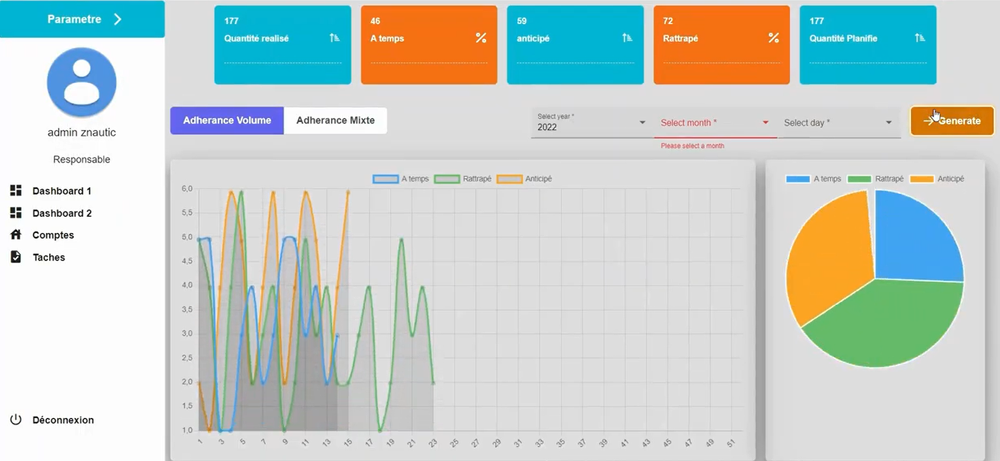

# TaskTracker

Website: [Demo](https://drive.google.com/file/d/1sEh10p0e3PIF3Pfo5FF8oPGiXlV8ckoo/view?usp=sharing)

[TaskTracker] is an application for visualizing and managing tasks.



### Angular + backend Project setup 
```
npm install
```
### Run Angular default port 4200
```
ng serve
```
### Run backend default port 8080
```
node server.js
```